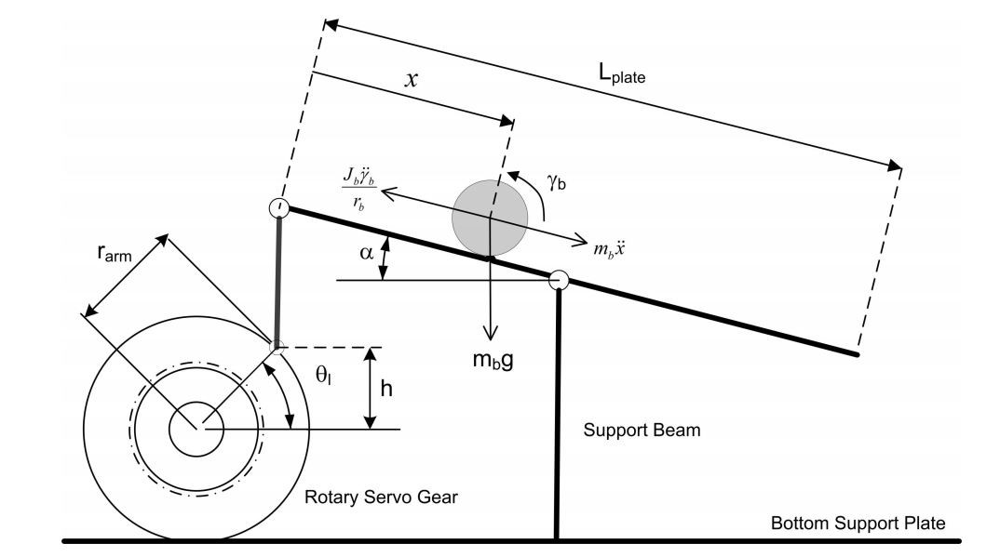

# Ball-on-Plate
-----------------------------------------------------------------------------------------
## 1. Introduction
The 2 DOF Ball Balancer or Project 2 is a system that will recognize the ball's motion on the plate and adjust its orientation to ensure that the ball is in control. MATLAB/Simulink will use a PD based control with multiple loops to control the system which will then be tested in CoppeliaSim. The system is a vision based control experiment that will communicate the balls position and two rotary servo motors will act on this to ensure that the ball will not fall off the plate.
### 1.1 Objectives
1. Create a mathematical model of the system using MATLAB/Simulink
2. Design a proportional-derivative control that will balance the ball on the plate
3. Simulate the MATLAB/Simulink control in CoppeliaSim to prove our PD control works 
4. Build a web page on GitHub that explains how the system works
### 1.2 Equipment
- 2 DOF Ball Balancer made by Quanser
- MATLAB/Simulink
- CoppeliaSim
- GitHub

## 2. Modeling
### 2.1 Background

### 2.2
### 2.3
## 3. Sensor Calibration
### 3.1 Background
### 3.2
### 3.3
## 4. Controller Design and Simulations
### 4.1 Background
### 4.2
### 4.3
## 5. Optional: Controller Design and Simulations

## 6. Checklist
